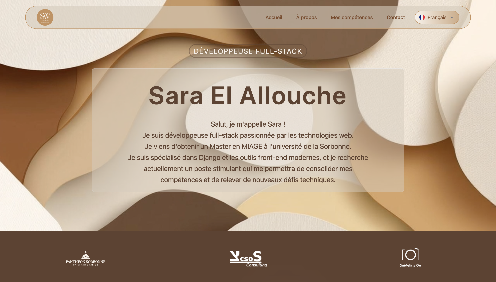

# 👩‍💻 Coding by Sara

**Coding by Sara** est un site web personnel développé avec **Django**, utilisant **Tailwind CSS**, **Alpine.js** et **HTMX** pour une expérience fluide, moderne et légère. Il me présente en tant que développeuse web Full Stack, avec mes compétences, mon parcours, mes projets, et un formulaire de contact.

---

## ✨ Aperçu



---

## 🔧 Technologies utilisées

- **[Django](https://www.djangoproject.com/)** — Framework web Python back-end
- **[Tailwind CSS](https://tailwindcss.com/)** — Framework CSS utilitaire moderne
- **[Alpine.js](https://alpinejs.dev/)** — JavaScript léger pour interactions réactives
- **[HTMX](https://htmx.org/)** — Manipulations DOM & requêtes AJAX côté serveur
- **HTML5** + **Template Django**
- **i18n** — Support multilingue (🇫🇷 Français / 🇬🇧 Anglais)

---

## 🚀 Fonctionnalités

- Présentation personnelle et de mon parcours
- Détail de mes compétences techniques
- Section projets
- Formulaire de contact
- Responsive design (mobile / desktop)
- Changement de langue dynamique
- Transitions et animations fluides
- Déployable sur AWS ou toute autre plateforme cloud

---

## 📁 Arborescence

.
├── config/ # Paramètres du projet Django
├── locale/ # Fichiers de traduction
├── static/ # Fichiers statiques finaux
├── static_src/ # Fichiers sources (ex: tailwind.config.js)
├── theme/ # Partie front, CSS, JS, HTML
├── website/ # App principale
├── manage.py
├── README.md
└── requirements.txt


---

## ⚙️ Installation locale

1. **Cloner le repo**
```bash
git clone https://github.com/saraelallouche/CodingBySara.git
cd CodingBySara
```
2. **Créer un environnement virtuel**
python -m venv venv
source venv/bin/activate  # ou venv\Scripts\activate sous Windows
3. **Installer les dépendances**
pip install -r requirements.txt
npm install
4. **Compiler le CSS avec Tailwind**
npm run build     # ou npm run dev pour watcher
5. **Lancer le serveur**
python manage.py migrate
python manage.py runserver

---

## 🌐 Déploiement

Le site peut être facilement déployé sur :

AWS EC2 / Lightsail
Render / Railway / Vercel (avec adaptateur Python)
Docker
Besoin d'aide pour le déploiement ? Voir build.sh ou me contacter.


---

## 📝 Licence

Projet personnel – tous droits réservés © 2025 Sara El Allouche.


---

## 👋 À propos de moi

Je suis Sara, développeuse fullstack passionnée par le code propre, l'expérience utilisateur et l'efficacité. Ce site est à la fois ma vitrine et mon terrain d’expérimentation.

➡️ Me contacter